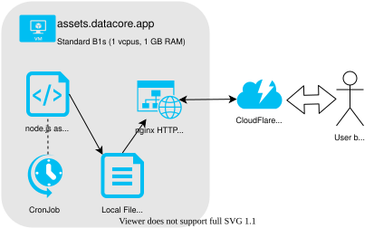
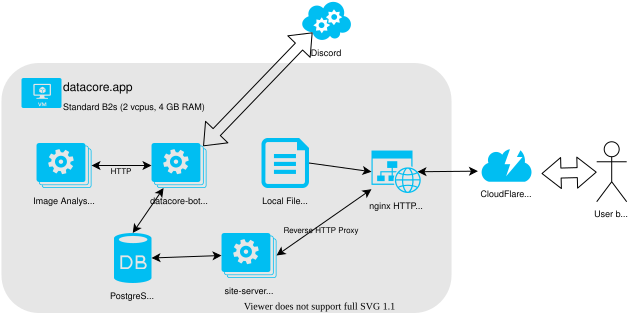

# Star Trek Timelines Data Core

DataCore 4.0 is a TypeScript and React application built with Vite. Navigation uses React Router (`react-router-dom`) and `BrowserRouter`, replacing Gatsby from DataCore 3.4.

## Requirements

- Node.js 20.19+ on the 20.x release line, or 22.12+ (required by the installed Vite 8 package).
- Yarn.
- Linux or WSL for the commands below, which use POSIX environment variable syntax.

## Local development

From the project directory:

```sh
yarn install
cp .env.defaults .env
```

Configure `.env` for your backend and image server. Include trailing slashes because the application appends paths:

```dotenv
VITE_DATACORE_URL=https://datacore.app/
VITE_ASSETS_URL=https://assets.datacore.app/
```

These values are included in the frontend bundle; do not put secrets in them. Restart development or rebuild production after changing them.

```sh
yarn develop
```

Open http://localhost:8881, or the address Vite prints if that port is occupied. `yarn start` and `yarn serve` run the same development command.

Public files, Markdown content, and structured JSON data live in `static/`. Before development, builds, and previews, `mdgen.js` generates `static/structured/markdown_pages.json` from Markdown front matter.

## Build and preview

```sh
yarn build
yarn preview
```

The build generates the Markdown index, runs the TypeScript project build, and bundles the frontend with Vite. Output goes to `build/`, bundled assets to `build/chunks/`, and public files are copied from `static/`.

Preview serves the existing production build locally at the URL it prints. Rebuild after changes to source code, content, or environment values. Host deployed files with a production web server.

## Deployment

Deploy the contents of `build/`. React Router uses browser history, so direct visits and refreshes on application routes must fall back to `index.html`.

For example, an nginx frontend location can use:

```nginx
location / {
    try_files $uri $uri/ /index.html;
}
```

Point the server root at the deployed build directory. Configure backend endpoints such as `/api/` and `/media/` separately so they reach the backend rather than the frontend fallback.

The old Gatsby and `publish.sh` instructions do not apply to this checkout. Use your deployment process to install dependencies, run `yarn build`, and deploy the output.

## Available scripts

| Command | Purpose |
| --- | --- |
| `yarn develop`, `yarn start`, `yarn serve` | Generate the Markdown index and start Vite on port 8881. |
| `yarn build` | Generate the Markdown index, check TypeScript, and build production files. |
| `yarn preview` | Generate the Markdown index and preview the existing build. |
| `yarn lint` | Run ESLint. |
| `yarn cy:open` | Open Cypress; start the application separately. |
| `yarn test:e2e` | Start development and open Cypress when the server is ready. |
| `yarn test` | Placeholder; this command does not run an automated test suite. |

## System overview

The frontend, backend, and asset hosting are separate components. Asset parsing and hosting can run on a separate machine for independent CDN and caching configuration.





### Website

The React frontend combines application code with Markdown content and structured JSON data. Vite produces a static frontend bundle, and React Router handles browser navigation. Dynamic features depend on backend services.

### Assets

A scheduled job scans, downloads, and unpacks assets such as crew images. An nginx HTTP server publishes them. Source: [asset-server](https://github.com/stt-datacore/asset-server).

### Image analysis

A standalone C++17 image-analysis service built with CMake, using OpenCV for image matching and Tesseract OCR for text recognition. It analyzes behold and voyage setup screenshots for the DataCore bot and exposes an HTTP interface that returns JSON results. Crew recognition data is generated from structured crew data and images from the asset server, then cached on disk. It replaces the earlier .NET implementation; the project README reports memory usage reduced from about 2.5 GB to under 500 MB. Source: [cpp-image-analysis](https://github.com/stt-datacore/cpp-image-analysis).

### Site server

Serves profile uploads and views, fleet information, and crew comments. Source: [site-server](https://github.com/stt-datacore/site-server).

### Discord bot

Written in TypeScript with discord.js. Source: [bot](https://github.com/stt-datacore/bot).

### Database

Stores profile associations with Discord users and crew comments. Consult the backend project for its current database configuration.

### DataScore

A separate TypeScript and Node.js toolset that generates scores and rankings for the DataScore system. It evaluates crew across voyages, gauntlets, shuttles, ship combat, quipment, and collections, with additional scripts for precalculation, ship battle simulations, and event statistics. These scripts read and update structured JSON data used by the website. The current implementation imports models and utilities from a sibling checkout named website and expects its static/structured/ directory, so clone the repositories side by side. Source: [datascore](https://github.com/stt-datacore/datascore).

### Data scripts

Maintainer scripts parse Big Book and Little Book data, items, ships, crew information, and event details from upstream sources. The frontend consumes the resulting content and JSON data.

## Contributing

Contributions are welcome. Read the [code of conduct](CODE_OF_CONDUCT.md) and [contribution guidelines](CONTRIBUTING.md). Use this README for DataCore 4.0 setup and commands; the contribution guidelines still contain legacy Gatsby instructions.
