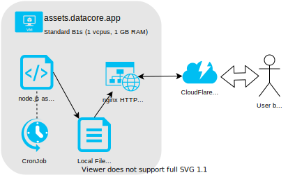

# Star Trek Timelines Data Core

## System overview

The assets (parsing, hosting) is set up on a separate machine to allow for more aggressive CDN / caching configuration, but the functionality could be combined with the main VM.

### System requirements
A Linux VM with 2 CPUs and 4Gb of dedicated RAM should suffice for the current levels of traffic. Total space used (by assets, the static website, uploaded profiles and the DB) is under 2Gb (SSD preferred). Average traffic is 1200 unique users / day (13000 unique users / month) with 630Gb CDN cached bandwidth (+210Gb non-cached).

### Components

#### the website
Written in TypeScript with React.js and built with Gatsby, combines source code with big book notes (as markdown) and other data (as json) to create a static website which needs to be uploaded to the server's file system (CI loop recommended for build validation and deployments).

#### assets
This VM runs a cronjob every 10 minutes that scans, downloads and unpacks new assets (crew images) to the local file system. There's also an nginx HTTP server that publishes the assets. Code is hosted [here](https://github.com/stt-datacore/asset-server).

#### Image analysis
Written in dotnet core and using OpenCV and Tesseract OCR, this is the most taxing (CPU and RAM) component of the system, used by the bot for recognizing behold (and voyage setup) screenshots. Code is hosted [here](https://github.com/stt-datacore/bot).

#### site-server
Serves the dynamic aspects of datacore.app (profile uploads / views, fleet info, crew comments). Code is hosted [here](https://github.com/stt-datacore/site-server).

#### discord bot
The Discord bot implementation (written in TypeScript with discord.js). See source code [here](https://github.com/stt-datacore/bot).

#### DB
A simple DB (currently LiteSQL but configurable) that links discord user ids with uploaded profiles (where associated) and includes the crew comments.

#### misc scripts
Scripts that take care of parsing the big / little book data, new items, ships and crew info and event details. These are currently manually executed by the maintainer 2-3 times a week and require regular maintenance to keep up with changes to the various upstream sources.

# System Requirements

As of v2.1, DataCore requires Node 18+, and yarn to build.

# Usage
On first run, run `publish.sh -f` to generate static frontend website. 

For future updates, setup a cron job that runs `publish.sh` once per hour.

`-f` flag forces website to be regenerated, otherwise content will only be regenerated when there is new content in remote github source.

# CONTRIBUTING

Contributions are always welcome, no matter how large or small. Before contributing, please read the [code of conduct](CODE_OF_CONDUCT.md).
