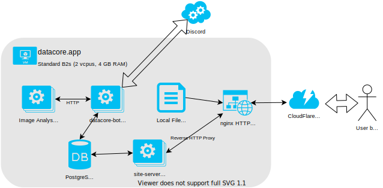

# Star Trek Timelines Data Core

As of May 2020, I'm preparing to archive the project (documentation, source code, data) in case someone wants to take over development in the future. The current situation (covid) doesn't afford me the time to continue working on it, and I'm also no longer having fun working on it alone.

## System overview

The assets (parsing, hosting) is set up on a separate machine to allow for more aggressive CDN / caching configuraiton, but the functionality could be combined with the main VM.

# CONTRIBUTING

Contributions are always welcome, no matter how large or small. Before contributing, please read the [code of conduct](CODE_OF_CONDUCT.md).